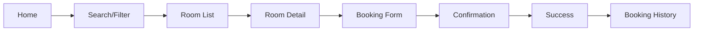

# UX_PROTOTYPE.md — GoStay

> **Dự án:** GoStay — website đặt phòng khách sạn (MVP)  
> **Giai đoạn:** Tuần 03 — UX Prototype (wireframe / mô tả màn hình)  
> **Lưu ý:** Prototype dùng **dữ liệu mẫu (mock data)**, chưa cần backend phức tạp.

---

## 1. Giới thiệu ngắn về GoStay

**GoStay** là website đặt phòng dành cho một chuỗi khách sạn nhỏ, chỉ xây dựng **phiên bản MVP** phù hợp nhóm sinh viên.

Ứng dụng giúp người dùng tìm chi nhánh/phòng của GoStay, xem chi tiết, đặt phòng theo ngày hoặc giờ, xem lịch sử đặt phòng. Admin và chủ chuỗi khách sạn có thể quản lý chi nhánh, phòng, giá và trạng thái. Tính năng **AI gợi ý phòng** chỉ hỗ trợ tìm kiếm — người dùng vẫn tự xem chi tiết và xác nhận đặt phòng.

---

## 2. Mục tiêu của prototype

| Mục tiêu | Mô tả |
|----------|--------|
| **Thống nhất giao diện** | Cả nhóm hiểu các màn hình cần có trước khi code |
| **Mô tả luồng chính** | Từ tìm phòng → đặt thành công trong ít bước |
| **Giảm scope** | Chỉ thiết kế màn hình trong MVP, không thêm thanh toán, chatbot, bản đồ |
| **Dùng mock data** | Demo bằng dữ liệu giả, không phụ thuộc API/backend sớm |
| **Hỗ trợ báo cáo** | Có tài liệu để trình bày với giảng viên / milestone Tuần 3 |

**Công cụ prototype gợi ý (tuỳ nhóm):** Figma, Canva, giấy vẽ tay, hoặc HTML tĩnh — tài liệu này mô tả **nội dung và luồng**, không bắt buộc một công cụ cụ thể.

---

## 3. Danh sách màn hình prototype đề xuất

| STT | Màn hình | Đối tượng | Ghi chú |
|-----|----------|-----------|---------|
| 1 | Home | Khách | Trang chủ, ô tìm kiếm nhanh |
| 2 | Login / Register | Tất cả | Đăng nhập, đăng ký |
| 3 | Branch / Room List | Khách | Danh sách chi nhánh/phòng GoStay |
| 4 | Search / Filter | Khách | Tìm theo chi nhánh/phòng, giá, loại phòng |
| 5 | Room Detail | Khách | Chi tiết một phòng |
| 6 | Booking Form | Khách | Chọn ngày/giờ, xác nhận thông tin |
| 7 | Booking Confirmation | Khách | Xem lại trước khi gửi đặt phòng |
| 8 | Booking Success | Khách | Thông báo đặt thành công |
| 9 | Booking History | Khách | Lịch sử đặt phòng |
| 10 | Admin Dashboard | Admin | Tổng quan quản trị |
| 11 | Admin Room Management | Admin / Chủ KS | CRUD phòng, giá, trạng thái |
| 12 | AI Recommendation | Khách | Gợi ý phòng theo nhu cầu (tùy chọn) |

---

## 4. Mô tả từng màn hình

### 4.1. Home (Trang chủ)

**Mục đích:** Giới thiệu GoStay và cho phép bắt đầu tìm phòng nhanh.

**Thành phần chính:**

- Logo / tên **GoStay**
- Slogan ngắn: *"Đặt phòng nhanh — đơn giản — rõ ràng"*
- Ô tìm kiếm: địa điểm hoặc tên khách sạn
- Nút **Tìm phòng**
- Link **Đăng nhập** / **Đăng ký**
- (Tuỳ chọn) Vài khách sạn nổi bật từ mock data
- Menu: Trang chủ | Danh sách phòng | Gợi ý AI | Lịch sử đặt phòng (khi đã đăng nhập)

---

### 4.2. Login / Register (Đăng nhập / Đăng ký)

**Mục đích:** Xác thực người dùng trước khi đặt phòng và xem lịch sử.

**Login:**

- Email / tên đăng nhập
- Mật khẩu
- Nút **Đăng nhập**
- Link sang **Đăng ký**

**Register:**

- Họ tên, email, mật khẩu, xác nhận mật khẩu
- Vai trò (tuỳ thiết kế nhóm): Khách / Chủ khách sạn / Admin (demo)
- Nút **Đăng ký**

**Lưu ý prototype:** Có thể dùng tài khoản mẫu `user@gostay.demo` / `admin@gostay.demo` để demo.

---

### 4.3. Hotel / Room List (Danh sách khách sạn / phòng)

**Mục đích:** Hiển thị danh sách kết quả sau tìm kiếm hoặc khi vào từ menu.

**Thành phần mỗi card phòng:**

- Ảnh thumbnail
- Tên phòng / tên chi nhánh GoStay
- Địa điểm (text, không dùng bản đồ trong MVP)
- Giá: theo **đêm** hoặc **giờ**
- Loại phòng (Single, Double, Deluxe…)
- Trạng thái: **Còn trống** / **Đã đặt** / **Bảo trì**
- Nút **Xem chi tiết**

---

### 4.4. Search / Filter (Tìm kiếm / Lọc)

**Mục đích:** Thu hẹp danh sách phòng theo nhu cầu.

**Bộ lọc đề xuất:**

| Trường | Ví dụ |
|--------|--------|
| Địa điểm / từ khóa | "Quận 1", "Đà Lạt" |
| Khoảng giá | Từ — Đến (VNĐ) |
| Loại phòng | Single, Double, Family |
| Hình thức | Theo ngày / Theo giờ |
| Tiện nghi (checkbox) | WiFi, điều hòa, bữa sáng |

- Nút **Áp dụng** và **Xóa bộ lọc**
- Kết quả cập nhật trên màn **Room List**

---

### 4.5. Room Detail (Chi tiết phòng)

**Mục đích:** Cung cấp đủ thông tin để quyết định đặt phòng.

**Nội dung hiển thị:**

- Gallery ảnh (2–4 ảnh mẫu)
- Tên phòng, tên khách sạn
- Địa chỉ / khu vực (text)
- Giá theo ngày và/hoặc giờ
- Mô tả ngắn
- Danh sách tiện nghi (WiFi, TV, máy lạnh…)
- Trạng thái phòng
- Nút **Đặt phòng ngay**
- Link quay lại danh sách

---

### 4.6. Booking Form (Form đặt phòng)

**Mục đích:** Người dùng chọn thời gian và nhập thông tin đặt phòng.

**Thành phần:**

- Tóm tắt phòng đã chọn (ảnh nhỏ, tên, giá)
- Chọn **ngày/giờ nhận phòng** (check-in)
- Chọn **ngày/giờ trả phòng** (check-out)
- Hình thức: theo ngày hoặc theo giờ
- Số người (tuỳ chọn)
- Ghi chú (tuỳ chọn)
- Tổng tiền ước tính (tính đơn giản từ mock)
- Nút **Tiếp tục** → sang xác nhận

**Không có:** thanh toán online, voucher.

---

### 4.7. Booking Confirmation (Xác nhận đặt phòng)

**Mục đích:** Cho người dùng kiểm tra lại trước khi gửi.

**Hiển thị:**

- Thông tin phòng
- Check-in / check-out
- Tổng tiền
- Trạng thái dự kiến: *"Đã đặt"* hoặc *"Chờ xác nhận"*
- Nút **Xác nhận đặt phòng**
- Nút **Quay lại sửa**

---

### 4.8. Booking Success (Đặt phòng thành công)

**Mục đích:** Thông báo kết quả tích cực.

**Nội dung:**

- Icon / message: *"Đặt phòng thành công!"*
- Mã booking mẫu (ví dụ: `GS-2026-001`)
- Tóm tắt: phòng, thời gian, tổng tiền
- Nút **Xem lịch sử đặt phòng**
- Nút **Về trang chủ**

---

### 4.9. Booking History (Lịch sử đặt phòng)

**Mục đích:** Khách xem các booking đã tạo.

**Bảng / danh sách:**

| Mã booking | Phòng | Check-in | Check-out | Tổng tiền | Trạng thái |
|------------|-------|----------|-----------|-----------|------------|
| GS-001 | Deluxe Double | 10/06 14:00 | 11/06 12:00 | 450.000đ | Đã đặt |

- Lọc đơn giản theo trạng thái (tuỳ chọn)
- Click một dòng → xem chi tiết booking (tuỳ chọn)

---

### 4.10. Admin Dashboard (Bảng điều khiển admin)

**Mục đích:** Tổng quan cho admin / chủ khách sạn.

**Thành phần gợi ý:**

- Số khách sạn / phòng trong hệ thống (mock)
- Số phòng **còn trống** / **đã đặt** / **bảo trì**
- Số booking gần đây
- Menu nhanh: **Quản lý phòng** | **Danh sách booking** (tuỳ chọn) | **Đăng xuất**

*Dashboard đơn giản, không cần biểu đồ phức tạp trong MVP.*

---

### 4.11. Admin Room Management (Quản lý phòng)

**Mục đích:** Admin hoặc chủ KS thêm, sửa, xóa phòng và cập nhật giá, trạng thái.

**Chức năng:**

- Danh sách phòng dạng bảng
- Nút **Thêm phòng mới**
- Form: tên phòng, khách sạn, loại, giá ngày/giờ, tiện nghi, URL ảnh mẫu, trạng thái
- Nút **Sửa** / **Xóa** / **Lưu**
- Đổi trạng thái: Trống → Đã đặt → Bảo trì

---

### 4.12. AI Recommendation (Gợi ý phòng bằng AI)

**Mục đích:** Hỗ trợ tìm phòng nhanh theo mô tả nhu cầu — **không thay** luồng đặt thủ công.

**Thành phần:**

- Ô nhập nhu cầu (ví dụ: *"Phòng Q1, WiFi, dưới 500k, 2 người"*)
- Hoặc form: địa điểm, ngân sách, số người, tiện nghi
- Nút **Gợi ý phòng**
- Danh sách 3–5 phòng gợi ý + lý do ngắn (mock hoặc AI sau)
- Disclaimer: *"Gợi ý từ AI — vui lòng xem chi tiết trước khi đặt"*
- Nút **Xem chi tiết** trên từng gợi ý → sang **Room Detail**
- **Không có** nút "AI tự đặt phòng"

---

## 5. Luồng người dùng chính

### 5.1. Luồng khách: Tìm phòng → Đặt thành công

```text
Home
  → (Đăng nhập nếu chưa có tài khoản)
  → Search/Filter hoặc Room List
  → Room Detail
  → Booking Form
  → Booking Confirmation
  → Booking Success
  → Booking History (tuỳ chọn)
```

### 5.2. Luồng khách: Dùng AI gợi ý (tùy chọn)

```text
Home / Menu "Gợi ý AI"
  → AI Recommendation (nhập nhu cầu)
  → Xem danh sách gợi ý
  → Room Detail (chọn một phòng)
  → Booking Form → ... (giống luồng chính)
```

### 5.3. Luồng admin / chủ khách sạn

```text
Login (tài khoản admin)
  → Admin Dashboard
  → Admin Room Management
  → Thêm / Sửa / Xóa phòng, cập nhật giá & trạng thái
```

### Sơ đồ tóm tắt (luồng khách)



---

## 6. Mock data đề xuất

Dùng dữ liệu mẫu cố định trong prototype — có thể hard-code hoặc file JSON tĩnh sau này.

### 6.1. Khách sạn mẫu

| ID | Tên khách sạn | Địa điểm |
|----|---------------|----------|
| H001 | GoStay Hotel Saigon | Quận 1, TP.HCM |
| H002 | GoStay Central Đà Lạt | Trung tâm Đà Lạt |
| H003 | GoStay Business Hà Nội | Cầu Giấy, Hà Nội |

### 6.2. Phòng mẫu

| ID | Khách sạn | Tên phòng | Loại | Giá/đêm | Giá/giờ | Trạng thái |
|----|-----------|-----------|------|---------|---------|------------|
| R001 | H001 | Standard Single | Single | 350.000đ | 50.000đ | Trống |
| R002 | H001 | Deluxe Double | Double | 550.000đ | 80.000đ | Trống |
| R003 | H002 | Family Room | Family | 800.000đ | — | Trống |
| R004 | H003 | Business Twin | Twin | 600.000đ | 90.000đ | Đã đặt |
| R005 | H001 | Studio Hourly | Studio | — | 120.000đ | Trống |

### 6.3. Tiện nghi mẫu (gắn vào phòng)

WiFi, Điều hòa, TV, Bữa sáng, Ban công, Bồn tắm

### 6.4. Booking mẫu (lịch sử)

| Mã | User | Phòng | Check-in | Check-out | Tổng | Trạng thái |
|----|------|-------|----------|-----------|------|------------|
| GS-2026-001 | user@gostay.demo | R002 | 10/06 14:00 | 11/06 12:00 | 550.000đ | Đã đặt |
| GS-2026-002 | user@gostay.demo | R005 | 12/06 09:00 | 12/06 15:00 | 720.000đ | Đã đặt |

### 6.5. Tài khoản demo

| Vai trò | Email | Mật khẩu (demo) |
|---------|-------|----------------|
| Khách | user@gostay.demo | demo123 |
| Admin | admin@gostay.demo | admin123 |

---

## 7. Lưu ý quan trọng về prototype

1. **Chỉ dùng dữ liệu mẫu** — chưa cần database và API hoàn chỉnh ở giai đoạn prototype.
2. **Chưa làm backend quá sớm** — ưu tiên thống nhất màn hình và luồng trước khi code server.
3. **Không có trong prototype MVP:** thanh toán online, voucher, tích điểm, QR check-in, chatbot, bản đồ tương tác.
4. **AI gợi ý phòng** có thể mock bằng rule đơn giản trước; tích hợp API LLM sau khi luồng booking ổn.
5. Prototype phục vụ **học tập và demo** — giao diện gọn, dễ hiểu cho sinh viên năm nhất.

---

*Tài liệu tham chiếu: `PRODUCT_DIRECTION.md`, `PRODUCT_ANALYSIS.md`, `REQUIREMENTS.md`*
